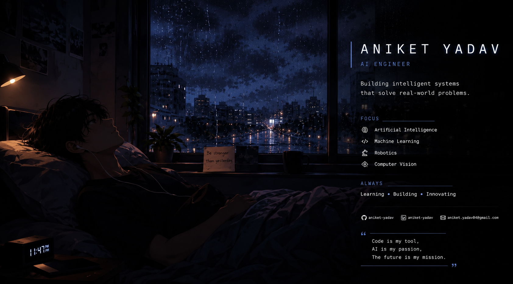
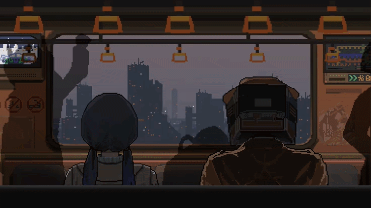

 
 <!-- ========================= FUTURISTIC HERO SECTION ========================= -->

 <div align="center">



</div>
 
 
 

 
</tr>
</table>

 

<!--<h2 align="center">🧬 About Me</h2>-->

<div align="center">

```text
╔══════════════════════════════════════════════════════════════╗
║  I don’t just write code — I architect intelligent futures. ║
╚══════════════════════════════════════════════════════════════╝
```

</div>


   🌌 Digital Identity


    * 🧠 Designing **AI systems** that learn, adapt, and evolve.
    * 🤖 Exploring the intersection of **Robotics + Artificial Intelligence**.
    * ⚡ Creating **futuristic applications** with immersive user experiences.
    * 🔬 Passionate about **Computer Vision, Deep Learning, and Automation**.
    * 🤖 Only the subtitle below changes with a typing animation.

---
 
 
 ### 🎯 Current Mission

```yaml
Learning:
  - Artificial Intelligence
  - Machine Learning
  - Robotics
  - Computer Vision
  - Deep Learning

Building:
  - AI-powered applications
  - Automation systems
  - Creative developer tools
  - Futuristic interfaces
```

---

 

</div>

---

<!--### 🚀 Beyond the Terminal

<div align="center">

| 🧠 Thinker  | 🤖 Builder | 🎨 Creator        | 🌌 Explorer   |
| ----------- | ---------- | ----------------- | ------------- |
| AI Research | Robotics   | UI/UX Experiments | Emerging Tech |

</div>--->

<div align="center">

### ⚡ *Turning imagination into intelligent reality.*

</div>


 

[](https://discord.com/users/1333782637533204490) [](https://www.linkedin.com/in/aniket-yadav-569995302) [](https://mastodon.social/@Anii) [](mailto:aniketyvd@gmail.com) 

 
💻 Code • Create • Innovate<br>🤖 AI | Robotics | Emerging Tech Explore<br>🧠 Fueled by curiosity & driven by innovation<br>🌱 Forever curious, forever learning
## 🌐 Socials:
[](https://discord.com/users/1333782637533204490) [](https://www.linkedin.com/in/aniket-yadav-569995302) [](https://mastodon.social/@Anii) [](mailto:aniketyvd@gmail.com) 
# 💻 Tech Stack:
       
<!-- Snake Game Repo View -->

<div align="center">
  
</div>

# 📊 GitHub Stats:
<br/>
<br/>

## 🏆 GitHub Trophies

### ✍️ Random Dev Quote

### 🔝 Top Contributed Repo

---
[](https://visitcount.itsvg.in)
